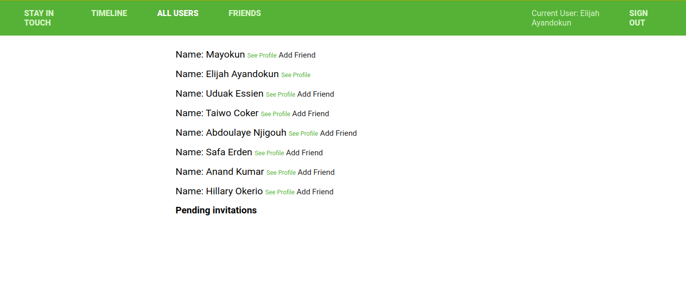

# Scaffold for social media app with Ruby on Rails

> This is a microverse Ruby on Rails project that simulates a simple social media app, with the use of associations and devise. Within the app, a user can sign up, login, send a friend request, accept friend request, post content, like content, comment on content and also unfriend a friend.

## Screenshot


## Built With

- Ruby v2.7.1
- Ruby on Rails v5.2.4
- Devise

## Live Demo

[Live Demo Link](https://rorsocialmedia.herokuapp.com)

## Getting Started

To get a local copy up and running follow these simple example steps.

### Prerequisites

Ruby: 2.7.1
Rails: 5.2.4
Postgres: >=9.5

### Setup

Install gems with:

```
bundle install
```

Setup database with:

```
   rails db:create
   rails db:migrate
```

### Usage

Start server with:

```
    rails server
```

Open `http://localhost:3000/` in your browser.

### Run tests

```
    rspec --format documentation
```

> Tests will be added by Microverse students. There are no tests for initial features in order to make sure that students write all tests from scratch.

## Author

👤 **Elijah Ayandokun**

- Github: [@ElijahTobs](https://github.com/ElijahTobs)
- Twitter: [@Elijahgr8](https://twitter.com/Elijahgr8)
- Linkedin: [linkedin](https://linkedin.com/in/ayandokunelijah)

## 🤝 Contributing

Contributions, issues and feature requests are welcome!

Feel free to check the [issues page](issues/).

## Show your support

Give a ⭐️ if you like this project!

## Acknowledgments

Thanks to [Microverse](https://github.com/microverseinc) for the [initial scaffold](https://github.com/microverseinc/ror-social-scaffold) which this project was built on.